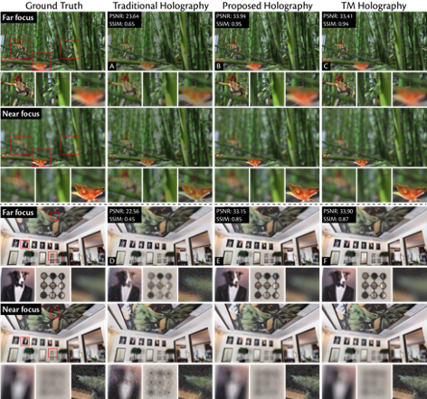
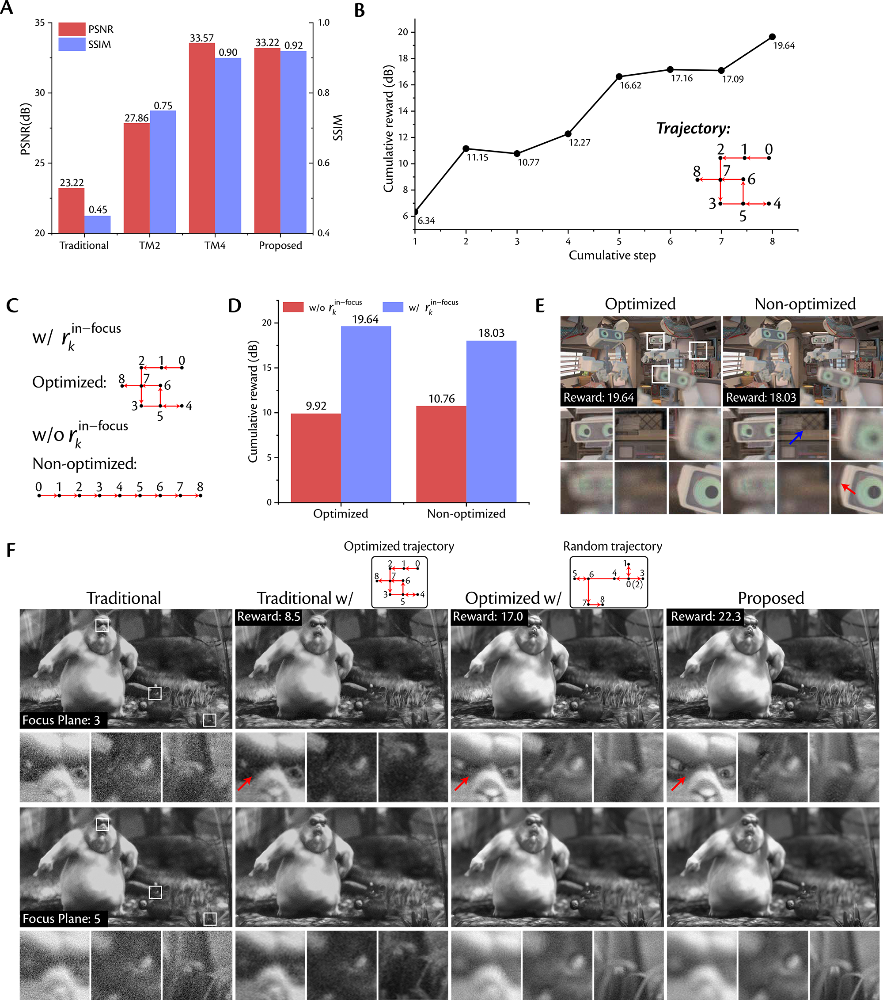
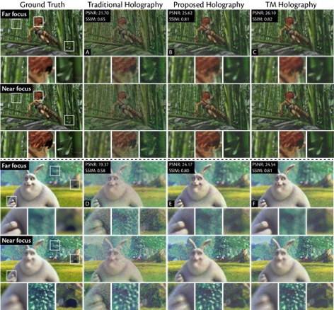

## Motion Hologram

> Here, we proposed a novel CGH technique called Motion Hologram to disrupt the spatial coherence of light source using reinforcement learning, which can thus render photorealistic and speckle-free 3D scenes by globally designing the holographic system. We reappraised the role of system motion, which was commonly believed detrimental in imaging and display, and conceptualized that the inherent speckles in holography could be neutralized and photorealistic 3D display could be achieved by spatially multiplexing the holograms via proper system motions. Specifically, a novel system design paradigm that leverages reinforcement learning to jointly generate the phase-only hologram and system’s motion trajectory were introduced, which promises an unparalleled viewing experience. To showcase the superior performance of the proposed technique, we conducted numerical simulations and experimental reconstructions alongside traditional and time-multiplexed holography methods. We developed a benchtop prototype and demonstrated that a 4~5 dB improvement in the PSNR is achieved compared with traditional holography, which also surpasses that of state-of-the-art time-multiplexed holography. Furthermore, our method is capable of accurately reconstructing full-color and high-fidelity multi-plane images with realistic defocus in visual effects. We believe the proposed method promises a new form of holographic displays that reconstructs photorealistic and speckle-free 3D scenes and provides a novel blueprint for computational design in various research areas.

## Simulation results

## Model analysis

## Experimental results

# Updating ...
